# DIY 3-Phase Variable Frequency Drive (VFD)

## Project Overview
This project involves the design and construction of a Variable Frequency Drive (VFD) to control the speed and torque of a 3-phase AC induction motor. The system utilizes an **ESP32 microcontroller** to generate Space Vector Pulse Width Modulation (SVPWM) signals. These signals are isolated and amplified to switch a High-Voltage IGBT bridge, converting rectified DC back into variable frequency AC.

Key features include:
* **High Voltage DC Bus** derived from standard AC mains.
* **Galvanic Isolation** protecting the logic circuitry from high voltage.
* **Bootstrap Gate Driving** for efficient high-side switching.
* **Manual Speed Control** via a potentiometer.

---

## Schematic Analysis

### 1. High Voltage DC Link
The power input stage accepts AC mains voltage. [cite_start]It flows through a **10A Fuse (F1)** for overcurrent protection and an **NTC Thermistor (TH1)** to limit the initial inrush current when the capacitors charge[cite: 1, 3, 4].

The AC is rectified by a **GBJ2510 Bridge Rectifier**, converting it to pulsating DC. This is smoothed by two parallel **470µF Electrolytic Capacitors (C1, C2)** to create a stable high-voltage DC Rail. A **100kΩ Resistor (R1)** acts as a bleeder to safely discharge the capacitors when power is removed.

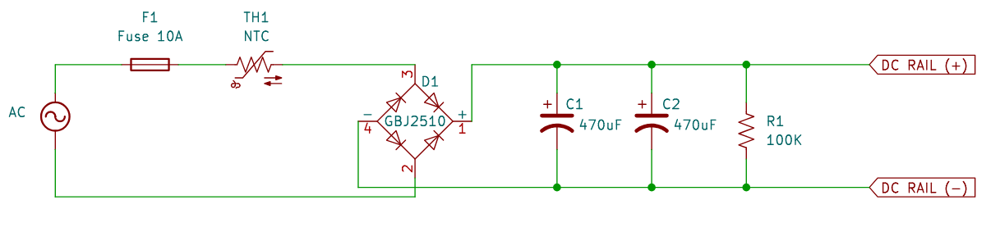

### 2. Control Logic (ESP32)
The **ESP32-DEVKITC-32D** is the central controller. It reads the target speed from a **10kΩ Potentiometer (RV1)** connected to the `SENSOR_VP` pin.

The ESP32 outputs six control signals (HIN and LIN for phases U, V, and W) to drive the motor.

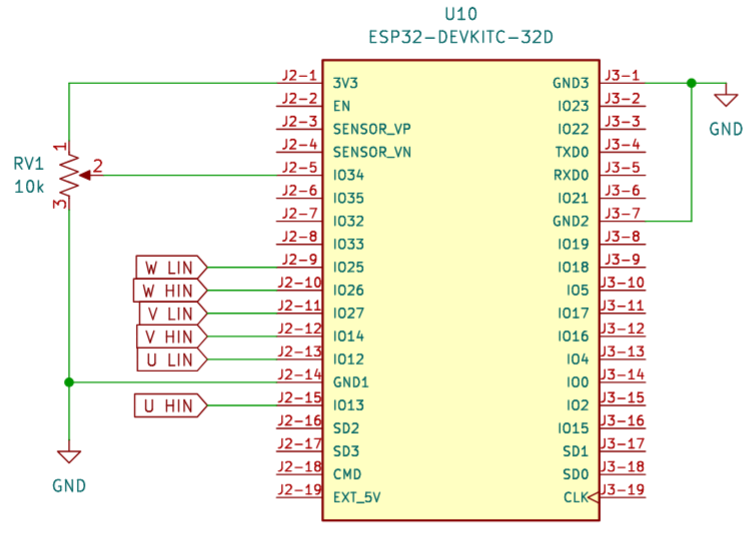

### 3. Signal Isolation (TLP350) and Gate Drivers (IR2110)
To ensure safety and noise immunity, the 3.3V logic signals from the ESP32 do not drive the power stage directly. They pass through **TLP350 Optocouplers**. These components use light to transmit the signal across an isolation barrier, protecting the microcontroller from the high-voltage DC rail.

The isolated signals are then fed into three **IR2110 Gate Driver ICs (U1, U4, U9)**. These chips provide the necessary current and voltage (15V) to switch the IGBTs rapidly.

The drivers utilize a **Bootstrap Circuit** consisting of **UF4007 Diodes (D2, D3, D4)** and **10µF Capacitors (C3, C6, C8)** to generate the floating voltage required to drive the High-Side IGBTs.

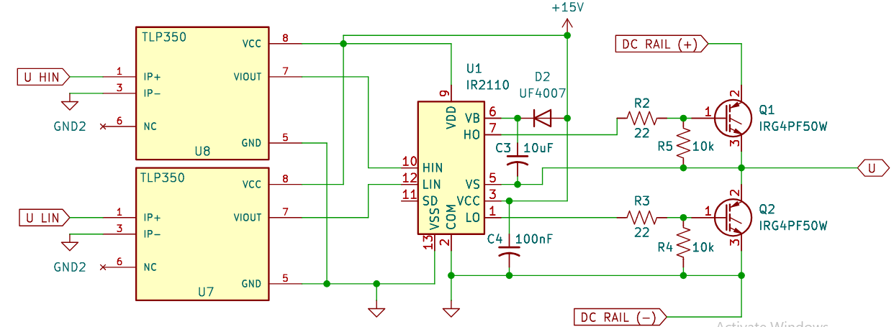

### 5. Inverter Output Bridge
The power output stage is a 3-phase bridge comprised of six **IRG4PF50W IGBTs**.
* **Phase U:** Q1 (High) and Q2 (Low).
* **Phase W:** Q3 (High) and Q4 (Low).
* **Phase V:** Q5 (High) and Q6 (Low).

**22Ω Gate Resistors** are used to control switching speed and reduce EMI, while **10kΩ Pull-down Resistors** ensure the gates stay off during startup.

---

## Component List

| Component | Purpose | Image |
| :--- | :--- | :--- |
| **ESP32-DEVKITC-32D** | Microcontroller for SPWM generation and control logic. | 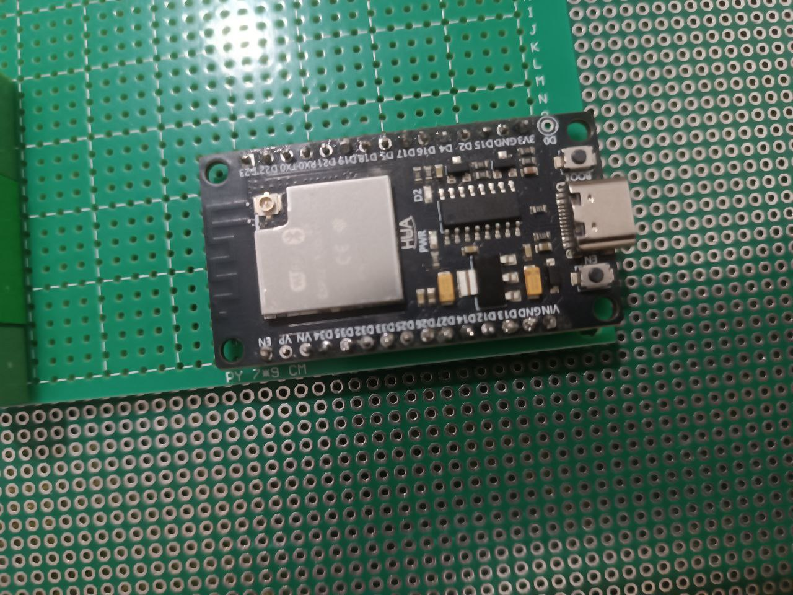 |
| **IRG4PF50W** | High-power IGBT switch for the inverter bridge. | 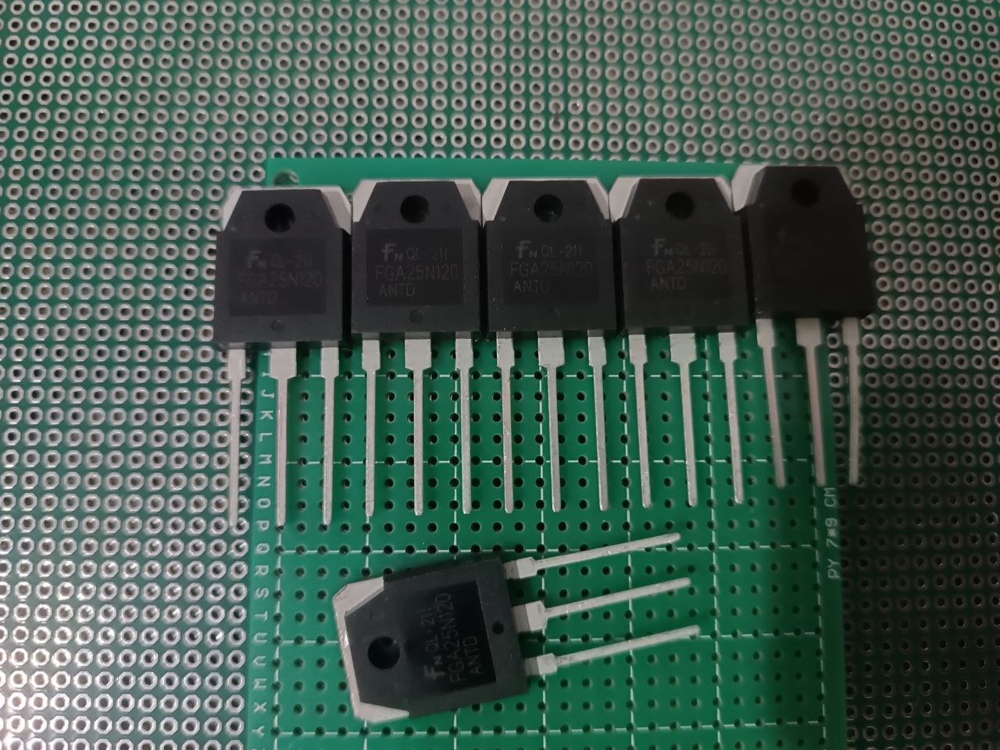 |
| **IR2110** | High/Low side driver IC for driving IGBT gates. | 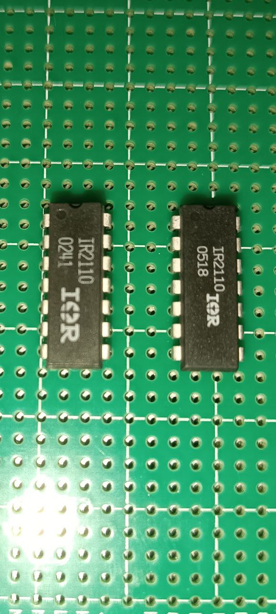 |
| **TLP350** | Optocoupler for galvanic isolation of logic signals. | 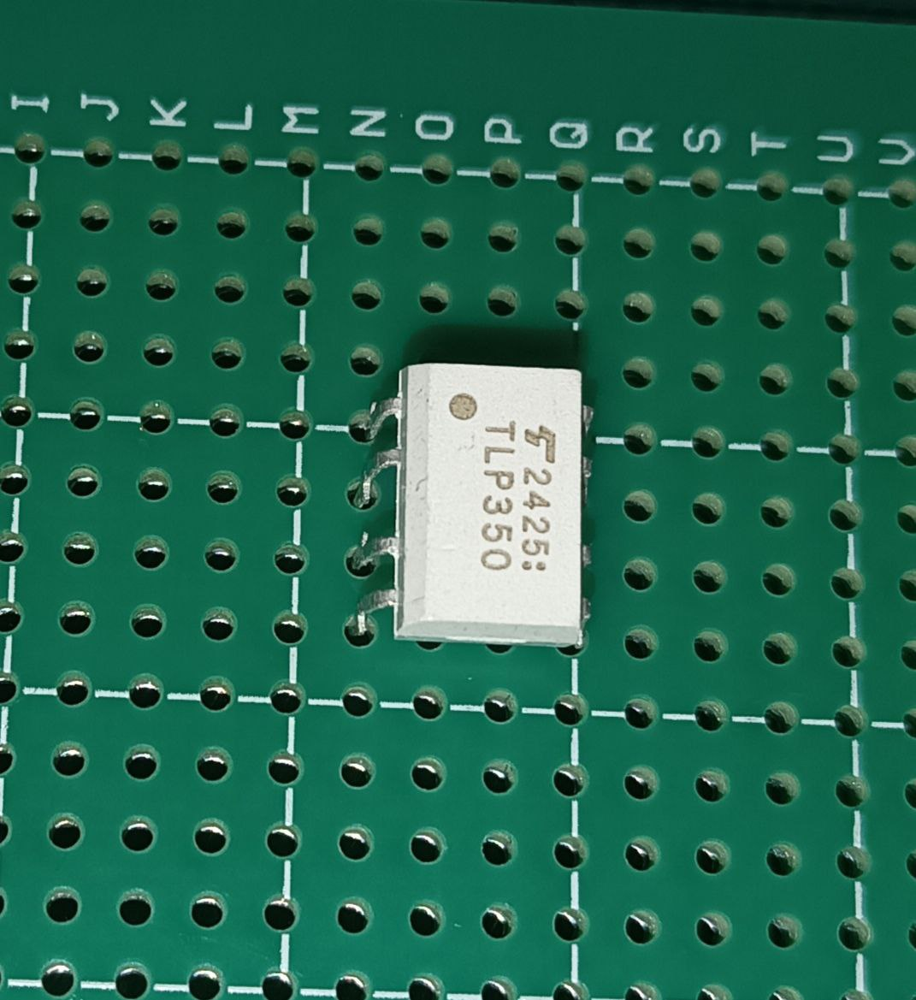 |
| **GBJ2510** | Bridge Rectifier to convert AC Mains to DC. | 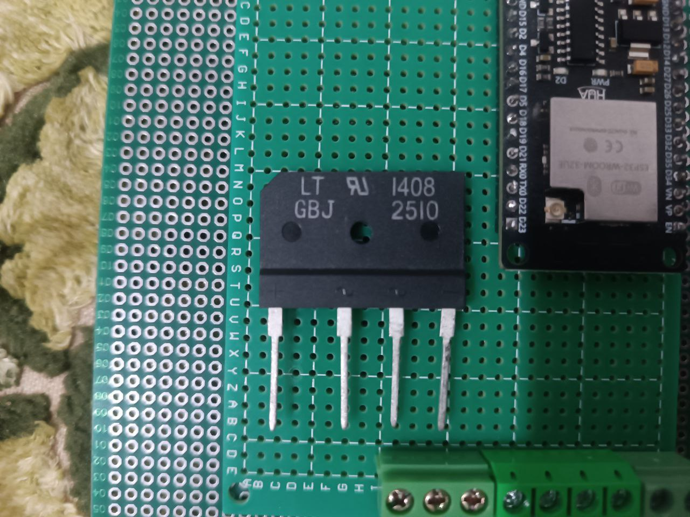 |
| **470µF Capacitor** | Smoothing capacitor for the high-voltage DC Bus. | 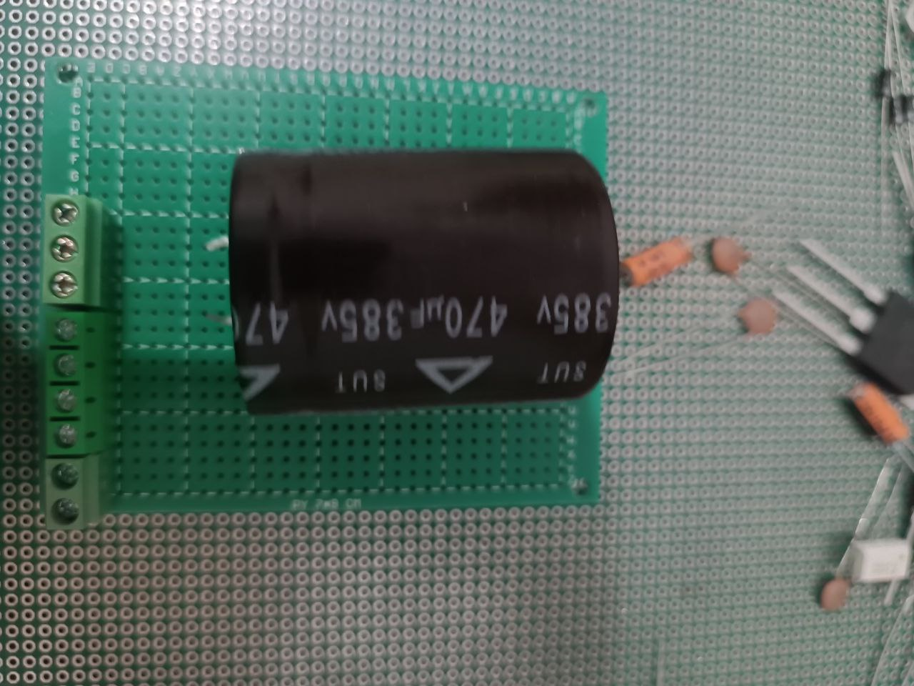 |
| **UF4007** | Fast recovery bootstrap diode for high-side driving. | 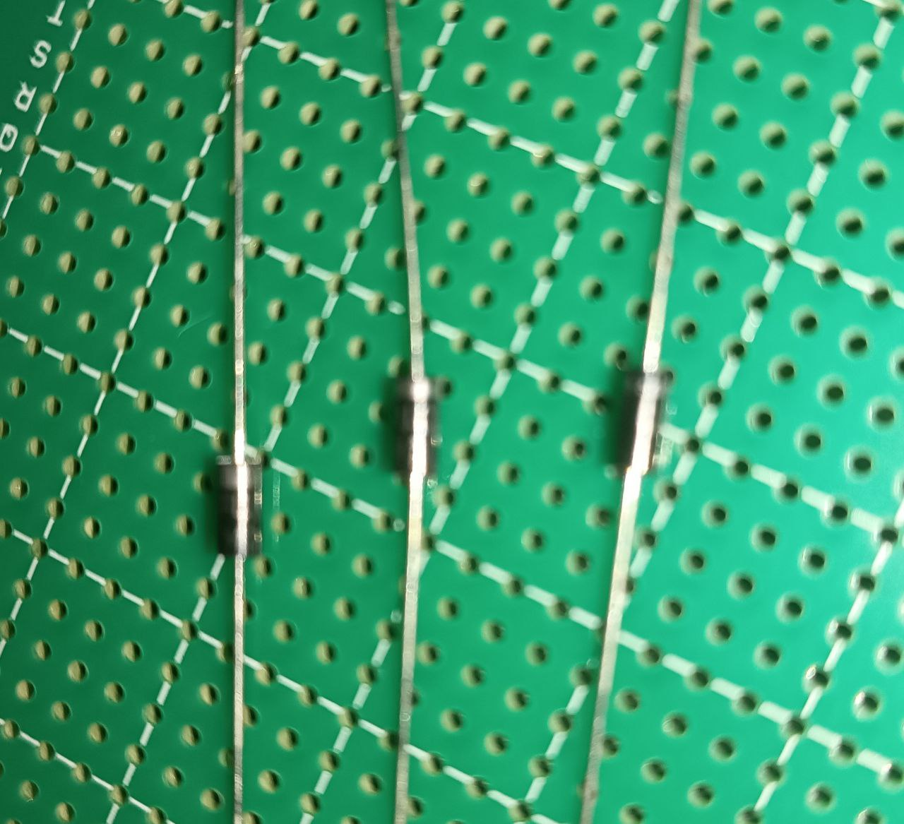 |
| **10k Potentiometer** | User input for setting motor frequency/speed. | 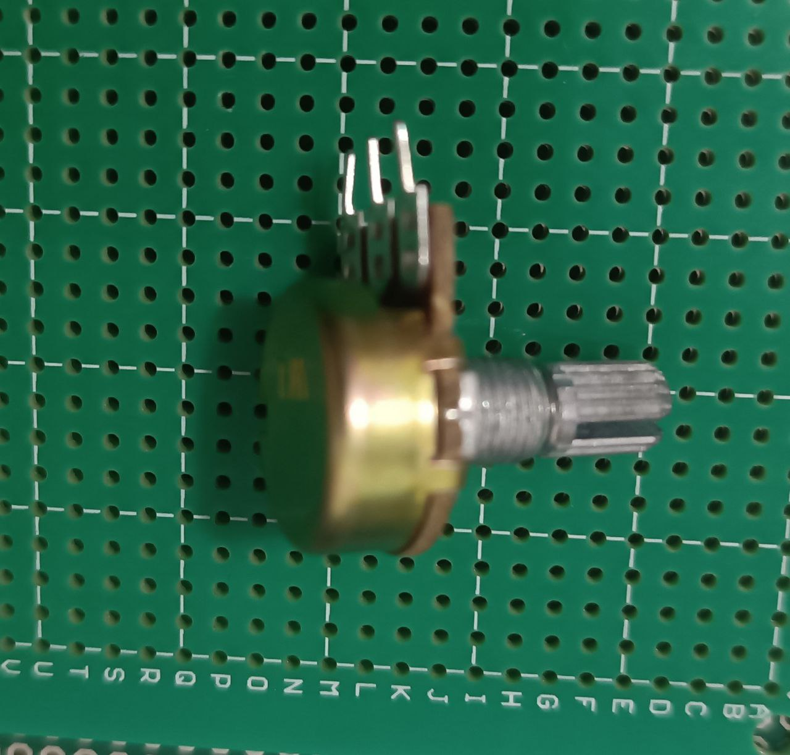 |
| **NTC Thermistor** | Inrush current limiter for circuit protection. | 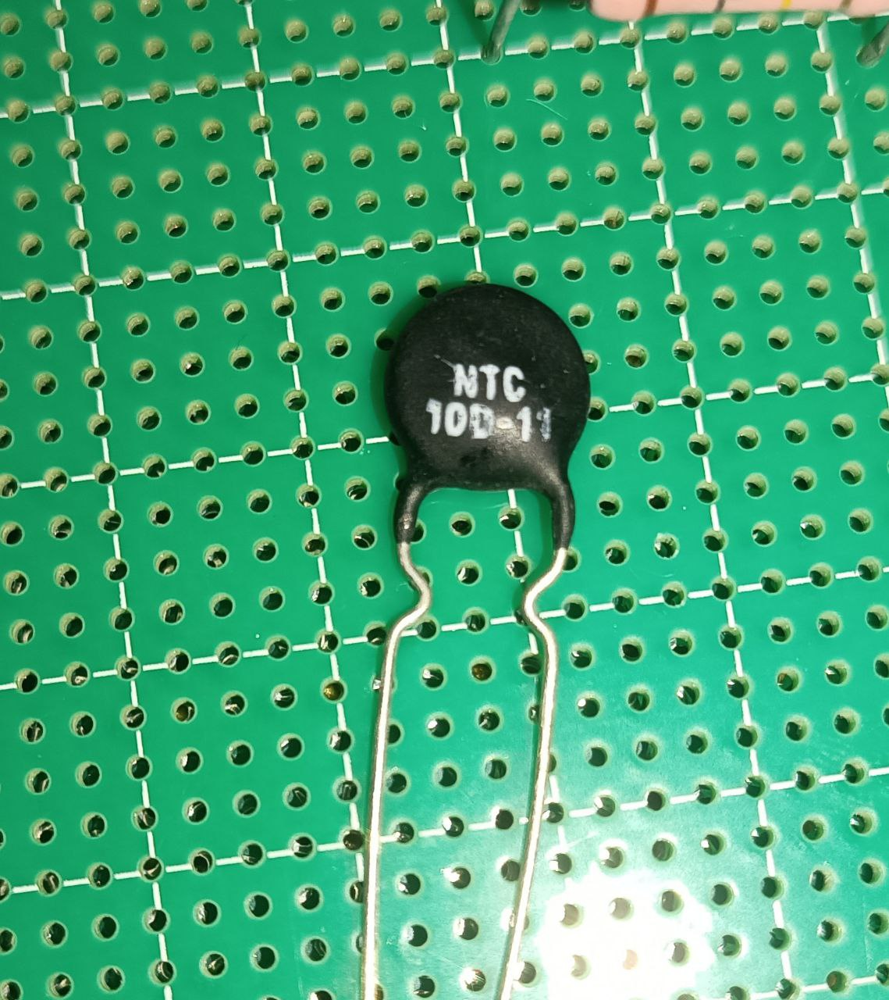 |
| **Fuse 10A** | Main power input safety protection. | 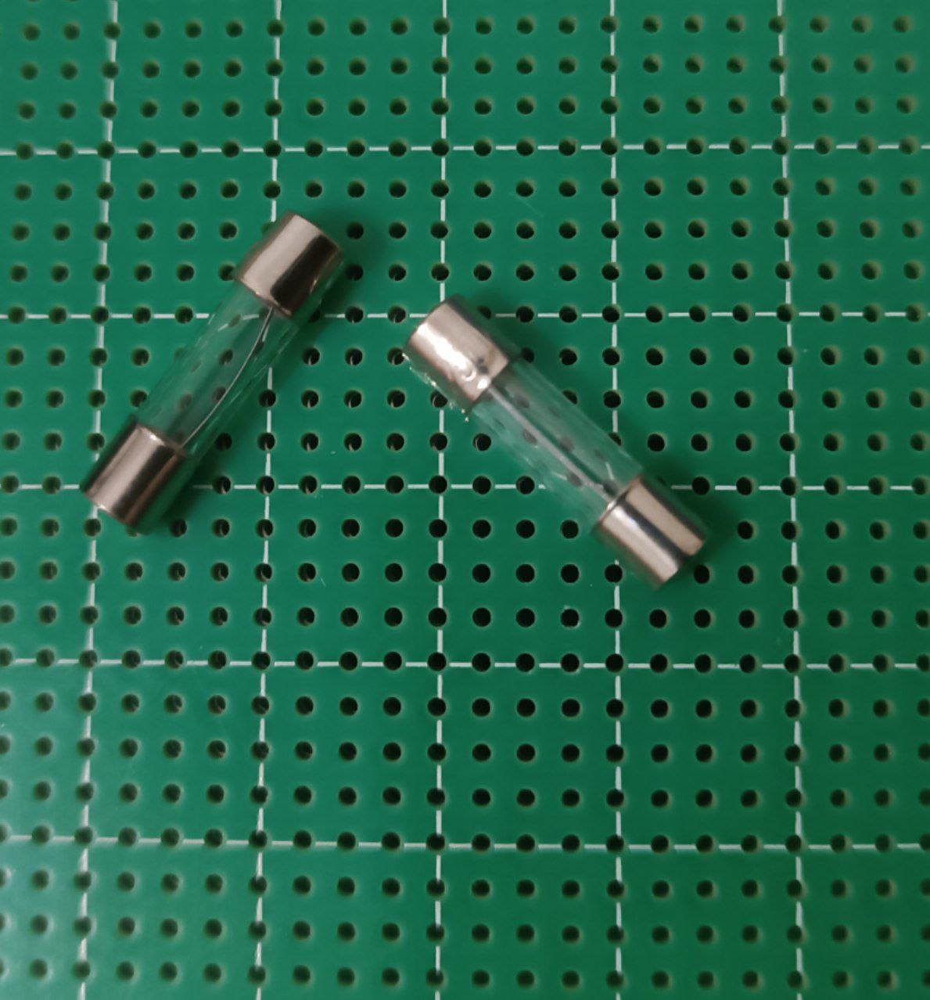 |
| **Resistor 22Ω** | Gate resistor to dampen ringing and limit peak current[cite: 21]. |  |
| **Resistor 10kΩ** | Pull-down resistor for IGBT gates. |  |
